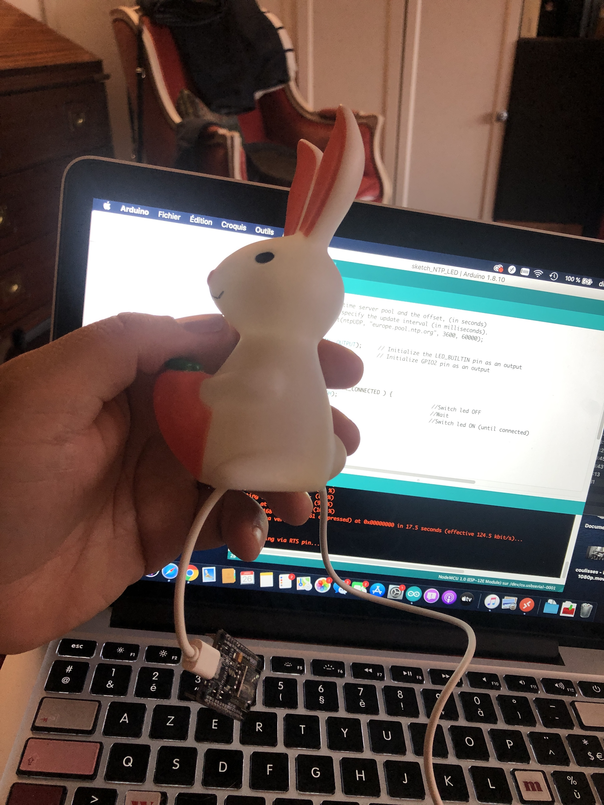

# ESP8266_NTP_LED_Kids-alarm-clock
A visual clock that lights up when it is ok to wakeup. 
Made from a cheap esp8266 dev board and an old rabbit lamp toy. 
Cost is minimal (5€) compared to some commercial product you can find on amazon (25-50€). 

Programming the ESP :

This cheap plastic light was holding an LED and a coin cell, you have to gut the bunny, sorry :

Plenty of room to insert an ESP :

Onboard LEDs are more than enough to shine through the plastic toy :

Todo : 

~- Blink leds until wifi is connected and NTP time aquired.~
- Add a web interface for editing times

There are several good NTP librairies and i used the one from : https://github.com/arduino-libraries/NTPClient .

